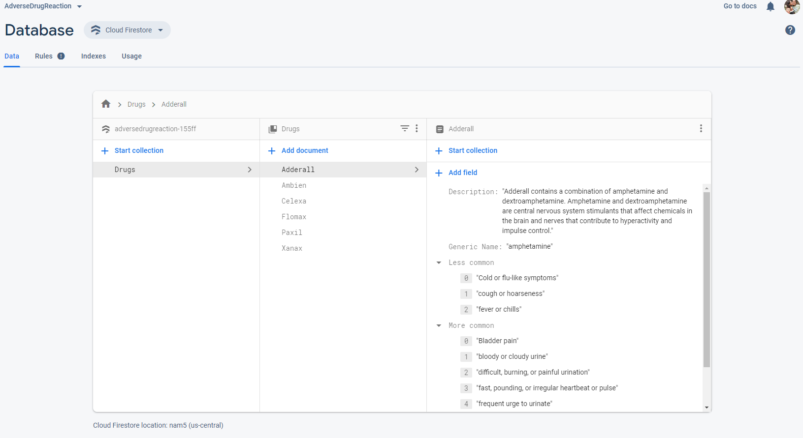

# AdverseDrugReaction
This is the assigmnment for Persuasive Computing Lab, Dalhousie University. A short video is attached, named as **ADR.mp4**, shows the complete workflow of the app. The video can be found 
in the main folder. For running the project, clone the following with Android Studio and then execute.

## Salient Features

### Direct Search
A list of options of the available medicines is shown. You can search for the name in the search bar and it will filter out the available options.
The options are first fetched from **Firebase Firestore**. Until that, all buttons are disabled. You can select only from the available options after 
the options are fetched. 

### Barcode detection
You have to first take image of the barcode and then you will have options to crop, rotate the taken image. This allows proper orientation of the taken image
and also helps you to remove unnecessary parts. After that, it is passed through a barcode scanner which detects the medicine name. If it is 
present in the database, you will be automatically shown the corresponding details.

### Chatbot
An IBM Watson chatbot is integrated along with this app. **If any other app with IBM Watson chatbot is present in the host device, the application
may not get installed.** The chatbot is trained for basic greetings and conversations. Also, if you search any medicine **even with wrong spellings
and generic name**, the chatbot detects that and redirects you to the medicine details page. 

### Scrollable Views
All views in the medicine details are scrollable. So long texts will not bother you. Moreover the symptoms are clickable.
When you click on a particular ADR, it shows you an option to search that on google and automatically opens **Google Search** with the selected ADR as search query.

### Database 
The databse is a hand-crafted database from the site [Drugs.com](https://www.drugs.com/drug_information.html). I am not responsible for the 
genuiness of the database. Moreover all the data is not taken. Only 5-6 ADRs are taken from each category for six medicines. The databse used here 
is Firebase Firestore. 
 

 
 
 ## Caution
 Please do not share this repository in a public domain. The repository contains raw Firebase and IBM Watson credentials which if found by google,
 google and IBM will invalidate the credentials and the app functioning will break down. Share the apk if needed after the building the code repository
